<p align="center">
  
</p>

<h1 align="center">🐓 Rooster Automation</h1>

<p align="center">
  <strong>Automatically sync your work schedule to iCloud Calendar — hands-free.</strong>
</p>

<p align="center">
  <a href="#-features"></a>
  <a href="#-quick-start"></a>
  <a href="#-how-it-works"></a>
  <a href="#-caldav-setup"></a>
  
</p>

<p align="center">
  <sub>Monitors your email → scrapes your work roster → pushes it to your calendar. Every week. Zero effort.</sub>
</p>

---

## 📖 What is Rooster Automation?

**Rooster Automation** is a fully automated Python pipeline that keeps your calendar up-to-date with your work schedule from the **ROI Online** staff portal.

> **The problem:** Every week a new roster is published, and you have to manually download and import it.
>
> **The solution:** A background service that does it all for you — from detecting the email notification to having the events show up on your iPhone.

---

## ✨ Features

|     | Feature              | Description                                                           |
| --- | -------------------- | --------------------------------------------------------------------- |
| 📬  | **Email Trigger**    | Monitors Gmail via IMAP for new roster notifications                  |
| 🤖  | **Auto Scraping**    | Uses Playwright to navigate and download `.ics` files from ROI Online |
| 📅  | **Calendar Sync**    | Uploads events directly to iCloud Calendar via CalDAV                 |
| 📱  | **Apple Ecosystem**  | Syncs across all your Apple devices instantly                         |
| 🕐  | **Smart Scheduling** | Only runs during configurable time windows (day & hours)              |
| 🔄  | **Retry Logic**      | Exponential backoff on failures for maximum reliability               |
| 🧹  | **Auto Cleanup**     | Removes events older than 90 days to keep your calendar clean         |
| 🐳  | **Docker Ready**     | One-command deployment with Docker Compose                            |

---

## 🔄 How It Works

```mermaid
graph LR
    A["📬 Gmail Inbox"] -->|IMAP check every 10 min| B["🔍 Gmail Monitor"]
    B -->|Trigger email found| C["🤖 ROI Scraper"]
    C -->|Playwright login + navigate| D["📄 .ics Download"]
    D -->|Parse & upload events| E["📅 CalDAV Service"]
    E -->|Sync| F["☁️ iCloud Calendar"]
    F -->|Auto-sync| G["📱 All Apple Devices"]

    style A fill:#EA4335,stroke:#EA4335,color:#fff
    style B fill:#FBBC04,stroke:#FBBC04,color:#333
    style C fill:#34A853,stroke:#34A853,color:#fff
    style D fill:#4285F4,stroke:#4285F4,color:#fff
    style E fill:#9C27B0,stroke:#9C27B0,color:#fff
    style F fill:#607D8B,stroke:#607D8B,color:#fff
    style G fill:#333,stroke:#333,color:#fff
```



---

## 🚀 Quick Start

### Option 1: Docker (Recommended)

```bash
# Clone the repository
git clone https://github.com/AlvaroHG/rooster_automation.git
cd rooster_automation

# Configure environment
cp .env.example .env
# Edit .env with your credentials (see Configuration below)

# Launch
docker compose up -d
```

### Option 2: Local Python

```bash
# Install dependencies
pip install -r requirements.txt
playwright install chromium

# Configure
cp .env.example .env
# Edit .env with your credentials

# Run
python main.py
```

---

## ⚙️ Configuration

### Environment Variables (`.env`)

| Variable               | Description                  | Required |
| ---------------------- | ---------------------------- | -------- |
| `ROI_EMAIL`            | ROI Online login email       | ✅       |
| `ROI_PASSWORD`         | ROI Online password          | ✅       |
| `GMAIL_ADDRESS`        | Gmail address for monitoring | ✅       |
| `GMAIL_APP_PASSWORD`   | Gmail app-specific password  | ✅       |
| `TRIGGER_EMAIL_SENDER` | Roster notification sender   | ✅       |
| `CALDAV_URL`           | CalDAV server URL            | ✅       |
| `CALDAV_USERNAME`      | Apple ID email               | ✅       |
| `CALDAV_PASSWORD`      | iCloud app-specific password | ✅       |
| `CALDAV_CALENDAR_NAME` | Target calendar name         | ✅       |

### Schedule (`config/config.yaml`)

```yaml
schedule:
  active_day: "wednesday" # Day to check for new rosters
  start_hour: 10 # Start of active window
  end_hour: 18 # End of active window

gmail:
  check_interval_minutes: 10
  max_emails_to_check: 10
```

---

## 🔑 CalDAV Setup

<details>
<summary><b>📋 Step-by-step iCloud Calendar setup</b></summary>

### 1. Generate an App-Specific Password

1. Go to [appleid.apple.com](https://appleid.apple.com/account/manage)
2. Navigate to **Sign-In and Security** → **App-Specific Passwords**
3. Click **Generate an app-specific password**
4. Name it `Rooster Automation`
5. Copy the generated password into your `.env`

### 2. Create the "Rooster" Calendar

1. Open the **Calendar** app on your Mac or iPhone
2. Create a new calendar named **Rooster**
3. Ensure it syncs with iCloud

> **Note:** If the calendar doesn't exist, events will be uploaded to your default calendar.

</details>

---

## 🏗️ Project Structure

```
rooster_automation/
├── main.py                        # Entry point
├── app/
│   ├── main.py                    # Orchestrator (RoosterAutomation)
│   ├── core/
│   │   ├── settings.py            # Pydantic Settings (YAML + env merge)
│   │   ├── logging_config.py      # Centralized logging
│   │   └── utils.py               # retry_on_failure decorator
│   └── services/
│       ├── gmail_monitor.py       # IMAP email monitoring
│       ├── roi_scraper.py         # Playwright web scraper
│       └── calendar_service.py    # CalDAV upload + cleanup
├── config/
│   └── config.yaml                # Non-secret configuration
├── tests/                         # Test suite
├── scripts/                       # Helper & debug scripts
├── Dockerfile                     # Playwright-based image
├── docker-compose.yml             # Production deployment
└── .env.example                   # Environment template
```

---

## 🐳 Docker Deployment

The Docker image is based on Microsoft's official Playwright image with all Chromium dependencies pre-installed.

```yaml
# docker-compose.yml highlights
services:
  rooster-automation:
    build: .
    restart: always
    environment:
      - TZ=Europe/Amsterdam
    volumes:
      - ./.env:/app/.env:ro
      - ./config:/app/config
      - ./logs:/app/logs
```

```bash
# Build and run
docker compose up -d

# View logs
docker compose logs -f rooster-automation

# Stop
docker compose down
```

---

## 🛠️ Troubleshooting

<details>
<summary><b>Common issues and fixes</b></summary>

| Issue                                    | Solution                                                      |
| ---------------------------------------- | ------------------------------------------------------------- |
| `ROI_EMAIL and ROI_PASSWORD must be set` | Check your `.env` file exists and has all values              |
| `GMAIL_APP_PASSWORD must be set`         | Generate a Gmail App Password, don't use your normal password |
| `Failed to search emails`                | Ensure IMAP is enabled in Gmail settings                      |
| Playwright browser errors                | Run `playwright install chromium`                             |
| `.ics` file not downloading              | Check ROI Online credentials and element IDs in `config.yaml` |
| Events not appearing                     | Verify CalDAV credentials and calendar name                   |

</details>

---

## 🧰 Maintenance

### Updating Element IDs

If ROI Online updates their portal, you may need to refresh the element IDs:

```bash
# Inspect the site to find new element IDs
python scripts/investigate_site.py

# Verify week navigation works
python scripts/verify_navigation.py
```

Then update the IDs in `config/config.yaml`.

---

## 📦 Tech Stack

<p align="center">
  
  
  
  
  
  
</p>

---

<p align="center">
  Made with ☕ and automation in mind<br/>
  <sub>Because life's too short to manually import your roster every week.</sub>
</p>
